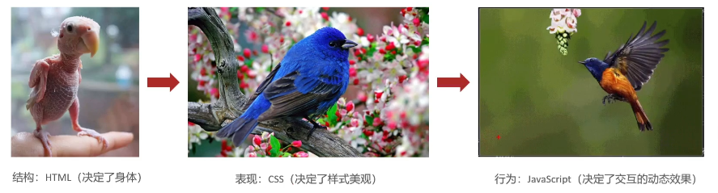
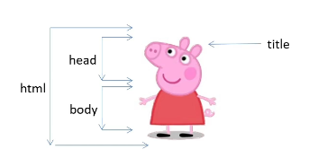

# 初识HTML

## 基础概念

### 浏览器

解析和渲染

---

- 渲染引擎：加载代码的速度、性能和效果不同

&ensp;&ensp;&ensp;&ensp;|浏览器|内核|备注|
&ensp;&ensp;&ensp;&ensp;|---|---|---|
&ensp;&ensp;&ensp;&ensp;|IE|Trident|360，百度|
&ensp;&ensp;&ensp;&ensp;|FireFox|Gecko| |
&ensp;&ensp;&ensp;&ensp;|Safari|Webkit| |
&ensp;&ensp;&ensp;&ensp;|Chrome/Opera|Blink|是Webkit的分支|
&ensp;&ensp;&ensp;&ensp;


### 💡Web标准

&ensp;&ensp;&ensp;&ensp;|构成|语言|说明|
&ensp;&ensp;&ensp;&ensp;|---|---|---|
&ensp;&ensp;&ensp;&ensp;|结构|HTML|页面元素和内容|
&ensp;&ensp;&ensp;&ensp;|表现|CSS|网页元素的外观和位置等页面样式（颜色、大小等）|
&ensp;&ensp;&ensp;&ensp;|行为|JavaScript|网页模型的定义与页面交互|
&ensp;&ensp;&ensp;&ensp;




```HTML
<strong>tttt</strong>

```


## HTML初体验

### HTML骨架结构


```HTML
<html>
  <head>
    <title>网页的标题</title>
  </head>
  <body>
  网页的主体内容
  </body>
</html>
```




### 开发工具

&ensp;&ensp;&ensp;&ensp;VS Code  Webstrom、Sublime  Dreamweaver  Hbuilder


### VS Code

&ensp;&ensp;&ensp;&ensp;- 输入 英文状态下的`!`再按下`回车` 或者`tab` 键可以自动生成基本骨架

```HTML
<!DOCTYPE html>
<html lang="en">
<head>
    <meta charset="UTF-8">
    <meta http-equiv="X-UA-Compatible" content="IE=edge">
    <meta name="viewport" content="width=device-width, initial-scale=1.0">
    <title>网页的标题</title>
</head>
<body>
    这是网页的主体
</body>
</html>
```


&ensp;&ensp;&ensp;&ensp;- 直接输入标签的英文可以生成标签

&ensp;&ensp;&ensp;&ensp;- 选中要修改的代码， `Ctrl` +`B` 可以继续选择下一个

## 语法规范

### 注释

快捷键`Ctrl` +`/` 

### 标签构成

`<` 、`>` 、`/` 等英文单词组成`<>` 包裹住的部分称为标签名 


双标签：开始标签、结束标签  

---

需要确定开始结束


单标签 `<br>`  `<hr>` 

---

不需要确定开始结束

### 标签关系

- 父子关系（嵌套）

```HTML
<head>
    <title></title>
<head>
```


- 兄弟关系（并列）

```HTML
<head></head>
<body></body>
```


